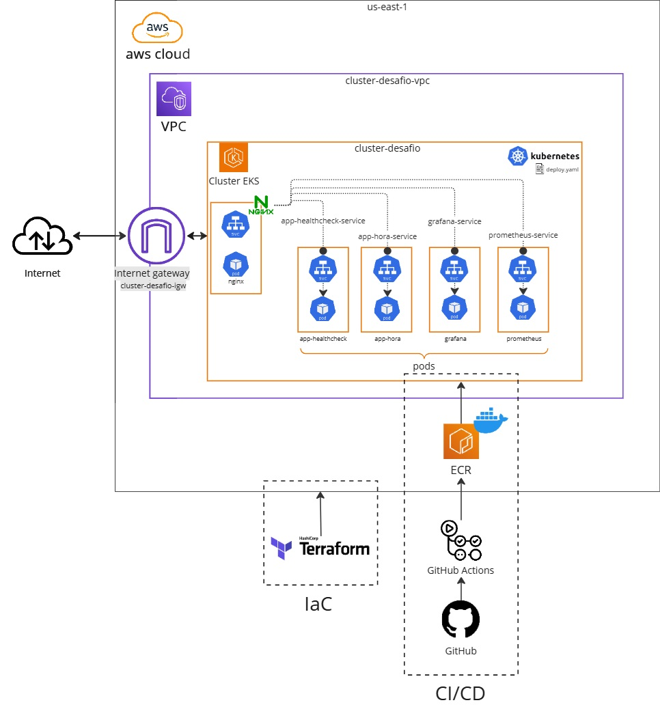
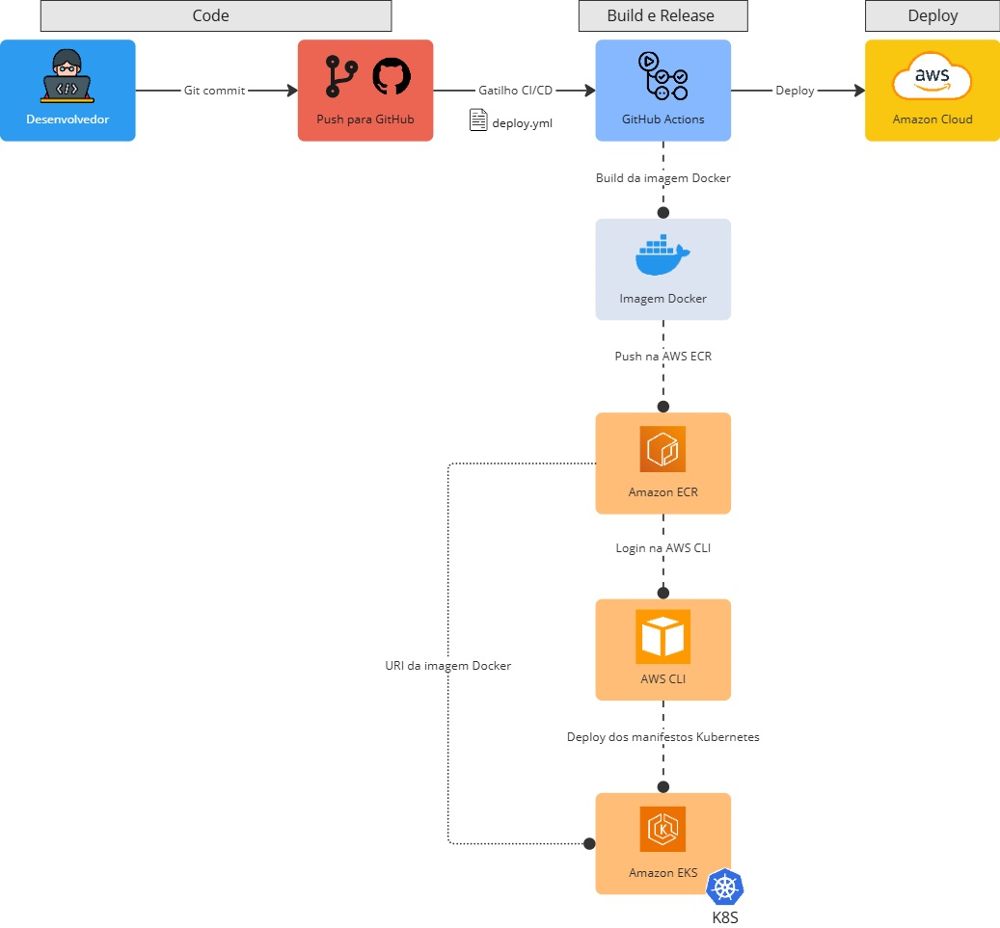
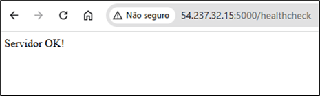
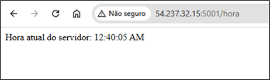
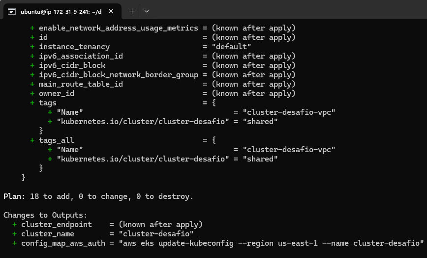
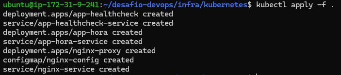
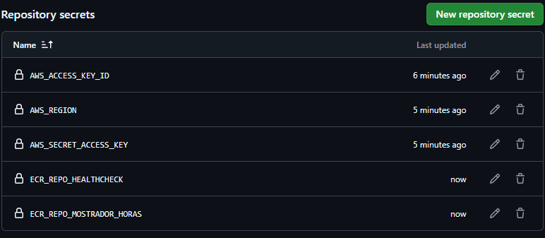
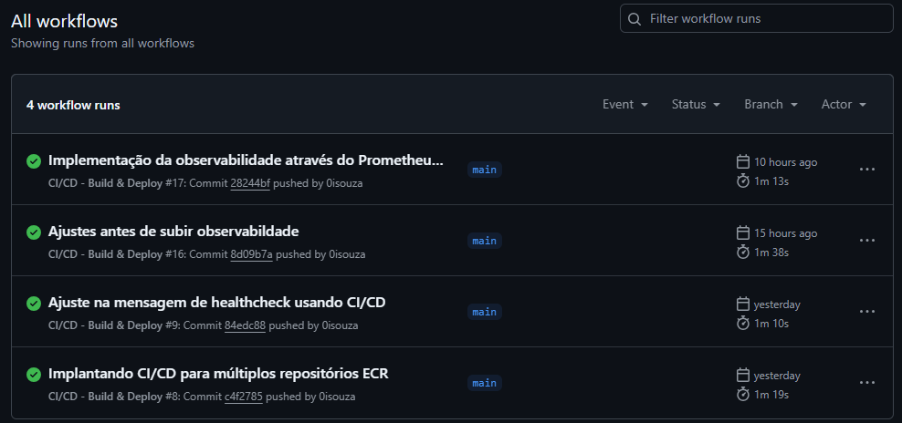
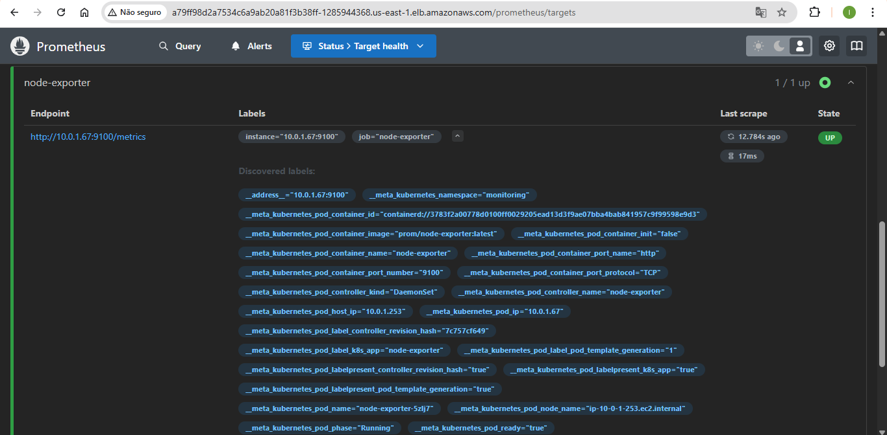
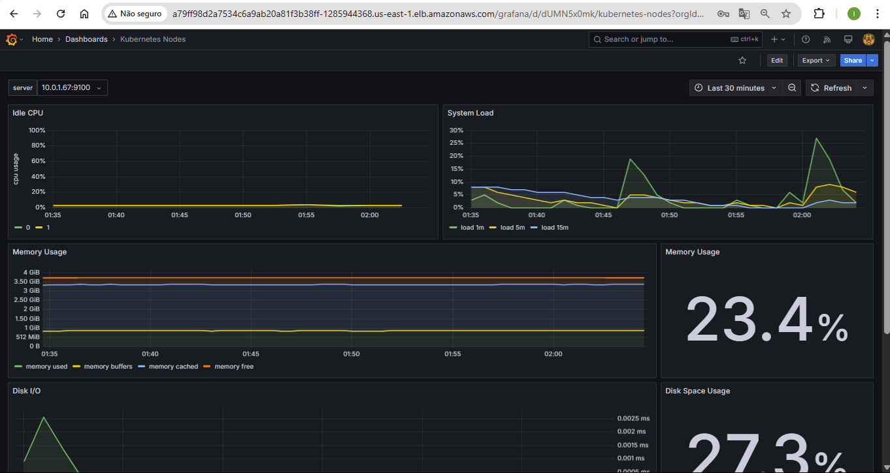

# Documentação - Desenho da Infraestrutura

A arquitetura apresenta um cluster EKS rodando aplicações, monitorado com Prometheus e Grafana, usando Nginx para rotear tráfego e uma pipeline CI/CD para automatizar deploys, com infraestrutura gerenciada pelo Terraform e armazenado na AWS.



# Documentação - Pipeline CI/CD: Atualização de componentes do código/infra



# Documentação - Prática das atividades realizadas

### Passo 1: Desenvolver as aplicações e rodar localmente:

Dependências e desenvolvimento do app de **healthcheck**:

1.  Instalação do **flask**, que servirá o app via web: `pip install Flask`
2.  Rodar o app localmente na porta 5000: `python3 healthcheck.py`

```py
from flask import Flask

app = Flask(__name__)

@app.route('/healthcheck', methods=['GET'])
def health_check():
    # Retorno da mensagem de healthcheck
    return "Servidor OK!"

if __name__ == '__main__':
    # Configuração para  '0.0.0.0', para permitir acessos de qualquer endereço IP
    app.run(host='0.0.0.0', port=5000)
```

&nbsp;

Dependências e desenvolvimento do app **mostrador de** horas:

1.  Instalação do **nodejs** e **npm** através do comando `sudo apt install nodejs npm`
2.  Instalação do **express**, que servirá o app via web: `npm install express`
3.  Iniciar o projeto através do `npm init -y`
4.  Rodar o app na porta 5001: `node index.js`

```js
// Importa o módulo express
const express = require('express');
const app = express();
const port = 5001;

// Rota para retornar a hora atual do servidor
app.get('/hora', (req, res) => {
    const dataAtual = new Date();
    const horaAtual = dataAtual.toLocaleTimeString();
    res.send(`Hora atual do servidor: ${horaAtual}`);
});

// Inicia o servidor
app.listen(port, () => {
    console.log(`Servidor rodando na porta ${port}`);
});
```

&nbsp;

### Passo 2: Implantar as aplicações usando Docker

1.  Instalar Docker na máquina na EC2: `sudo apt-get install docker.io`
2.  Garantir as permissões do Docker para o user atual: `sudo usermod -a -G docker $(whoami)`
3.  Aplicar as permissões de grupo sem deslogar: `newgrp docker`

&nbsp;**Implantação do App healthcheck**

1.  Criar arquivo **dockerfile**
    
2.  Construir a imagem docker: `docker build -t app-healthcheck .`
    
3.  Executar a imagem criada: `docker run -d -p 5000:5000 app-healthcheck`.
    

&nbsp;       Primeira aplicação rodando na porta 5000

&nbsp;       

&nbsp;**Implantação do app mostrador de hora**

1.  Criar arquivo **dockerfile**
2.  Construir a imagem docker: `docker build -t app-mostrador-horas .`
3.  Executar a imagem criada: `docker run -d -p 5001:5001 app-mostrador-horas`.

&nbsp;       Segunda aplicação rodando na porta 5001.

&nbsp;       

&nbsp;

### Passo 3: Subir os containers em um cluster do Kubernetes

1.  Preparar credenciais e instalar ferramentas:
    1.  Criar credencial de acesso no IAM e anotar os dados da Acess Key.
    2.  Instalar o AWS CLI se não tiver instalado ainda.
    3.  Configurar a AWS CLI através do comando: `aws configure`, na região desejada (us-east-1)
    4.  Instalar o **kubectl** e **terraform**.
2.  Implantar o cluster usando o `terraform apply`.
3.  Aplicar os recursos **.yaml** usando o `kubectl apply -f .`.

Saída do `terraform plan`:



&nbsp;

Conectar ao cluster EKS usando a configuração do kubectl  `aws eks update-kubeconfig --name cluster-desafio`

Saída do `kubectl apply -f .`



&nbsp;

**Passo 4: Implantar CI/CD para automatizar o deployment**

1.  Configurar as secrets do repositório (AWS Access Key, região, e URIs das imagens no ECR).
2.  Ajustar o Workflow no GitHub Actions

Configuração das secrets:

****

Deploys automatizados:



&nbsp;

**Passo 5: Deploy da observabilidade usando Prometheus + Grafana**

1.  Criação dos arquivos de confguração (.yaml) em **/infra/monitoramento**, que farão o deployment e configuração das ferramentas
2.  Atualização do **ConfigMap** do Nginx, para mapear o redirecionamento e garantir que operarão em **subpath**.
3.  Implementar ferramentas através do `kubectl apply -f .`
4.  Se necessário, reiniciar Nginx através do `kubectl rollout restart deployment nginx-proxy`.

Arquivos para a configuração:  
..  
├── monitoramento  
    │   ├── **grafana-deployment.yaml** -> Deployment do Grafana + grafana-service para expor a ferramenta  
    │   ├── **prometheus-clusterrole.yaml** -> Permissões necessárias paro o Prometheus acessar recursos dentro do cluster.  
    │   ├── **prometheus-clusterrolebinding.yaml** -> Associação da ClusterRole a uma conta de serviço (ServiceAccount).  
    │   ├── **prometheus-configmap.yaml** -> Configuração do Prometheus: fontes de dados,intervalos de scraping, etc.  
    │   ├── **prometheus-deployment.yaml** -> Deployment do Prometheus  
    │   ├── **prometheus-kube-state-metrics.yaml** -> Métricas para monitorar a saúde e o desempenho do cluster Kubernetes.  
    │   ├── **prometheus-node-exporter.yaml** -> Métricas para monitorar o desempenho do hardware dos nós.  
    │   ├── **prometheus-service.yaml** -> Define o Service que expõe o Prometheus para o cluster   
    │   └── **prometheus-serviceaccount.yaml** -> ServiceAccount utilizada pelo Prometheus garantindo acesso aos recursos do cluster.

&nbsp;

**Resultado do monitoramento implantado:**

**Alguns Targets coletadas pelo Prometheus**



&nbsp;

**Visualização das métricas no Grafana:**



&nbsp;

# Opcional: Destruir recursos criados

Destruir recursos do Kubernetes **antes** de destruir o cluster: `kubectl delete -f .`

Destruir infra criada pelo terraform (cluster): `terraform destroy`

&nbsp;

&nbsp;

# Sugestões de melhoria

**1 - Observabilidade das aplicações criadas**

&nbsp;       O uso de Prometheus e Grafana para monitoramento já foi implementado na infraestrutura, mas a configuração da **observabilidade para as aplicações desenvolvidas** aumentaria a da saúde do projeto.

**2 - Testes e Validação**

&nbsp;       Seria interessante incluir testes no pipeline CI/CD, validando se as rotas /healthcheck e /hora continuam funcionando a cada cada deploy. Outro ponto interessante são os **testes de carga e stress** (tanto das aplicações quanto da infraestrutura), para ajudar a identificar gargalos com antecedência.

**3 -  Escalabilidade e Alta Disponibilidade**

&nbsp;       A implementação de políticas de **escalonamento automático** com base na carga de tráfego podem ajudar a  manter as aplicações estáveis. Outro ponto seria a configuração de múltiplas instâncias no Kubernetes, garantindo alta disponibilidade e balanceamento de carga eficiente.

**4 - Ajuste no cache da aplicação de horas**

&nbsp;       Em um cenário onde a rota **/hora** precisasse ser acessada com frequência, seria interessando pensar em legal seria **diminuir o tempo de expiração do cache** (1min pode estar sendo muito), ou até mesmo implementar uma **página dinâmica** para que os usuários tenham acesso as informações atualizadas.

&nbsp;

# Conclusão

Neste desafio, criei uma infraestrutura automatizada e monitorada, utilizando Kubernetes, CI/CD, Prometheus e Grafana. Desenvolvi e containerizei as aplicações, implantei no EKS da AWS, e configurei uma pipeline CI/CD para automação de deployments. A integração do Prometheus e Grafana permitiu monitorar o desempenho do sistema em tempo real, garantindo a visibilidade e saúde do ambiente.

O uso do Terraform facilitou o gerenciamento da infraestrutura, enquanto o Nginx assegurou o cache e o roteamento do tráfego. Ao final, o processo resultou em uma solução escalável, automatizada e monitorada, com aprendizado prático em DevOps e Cloud Computing.
